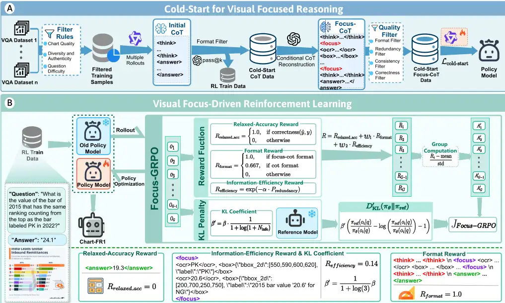

# Chart-FR1: Visual Focus-Driven Fine-Grained Reasoning on Dense Charts[^1]

_面向密集图表的视觉焦点驱动细粒度推理：视觉聚焦思维链Focus-CoT、焦点驱动的强化学习方法Focus-GRPO、图表信息密度基准HID-Chart_

## 问题：
有限的细粒度感知、噪音（冗余信息）干扰推理、缺乏自适应深度推理。

现有图标测试集不行。

## 解决方案：
- Focus-CoT：
  -  强制把每一步推理都跟具体的视觉线索挂钩

- Focus-GRPO：
  - 信息效率奖励，惩罚模型关注没用的重复信息，逼着高效聚焦
  - 宽松准确度奖励
  - 自适应KL惩罚，根据模型关注了多少关键线索，动态调整对推理深度的约束

- HID-Chart：
  - 专门为高密度图标设计的全新测试基准，衡量图标复杂度的信息密度指标

- Chart-FR1模型：
  - 基于前两项技术，训练出SOTA性能

### 细节：

#### 1. Focus-CoT：视觉聚焦的链式思维(Chain of Thought)

这个很像是为了解决之前看到的一个报告称模型不看图片仅瞎说都能取得较高正确率的问题。

所以让推理过程和视觉线索紧密绑定。每当模型需要进入下一步推理时，必须先用这个`<focus>`标签指出它关注到了哪个关键的视觉元素。

这个视觉元素可以是通过OCR识别出来的文字，也可以是定位到的图像局部区域。只能实实在在地“看”图表中的某个地方，然后基于“看”到的内容进行推理。确保模型的思考是有依据、有焦点的。 

还有呢……为了使模型学会“看”和“想”结合的能力，还涉及了一套自动化流水线来生成训练数据。先用基础模型来生成初步推理链，然后用强大模型来检查：

- 错的话，指出错在哪，补充上正确的视觉线索，并加上focus标签；若对了，就在关键步骤上加focus标签以加强视觉关联。最后经过几轮筛选，得到高质量的Focus-CoT数据，用来监督式微调模型，让它初步掌握这种视觉聚焦推理的技巧。

_接下来有了标准的训练集后，再来看看模型采用了什么新方法去强化学习。_

#### 2. Focus-GRPO：视觉驱动的强化学习

>**GRPO(Groupwise Relative Policy Optimization)** 由Deepseek提出，是一种专门为LLM的强化学习训练设计的策略优化算法。设计的目的是优化LLM的RLHF训练困境。在谈这个之前，我们先来澄清一个误区，大语言模型LLM的训练过程与小型模型不同，并不是简单地将生成的答案与标签简单对比就是了。举个这样的例子，对于小学数学题，这确实可以，23*17的答案是多少，模型得出是391,标准答案也是391,ok奖励是1,这叫规则奖励。但很多问题不存在唯一标准答案，“请写一封礼貌的辞职邮件/解释量子力学/给这段代码做安全审查/如何安慰失去亲人的朋友”这类任务不能简单地做字符串匹配，两个措辞完全不同的回答都可能效果很好。况且对于这类问题，连人类也不能给出一个完全正确的答案，又怎么能去要求机器呢？

>更重要的是，即使最终答案可以判断，训练仍然会遇到“责任应该算给谁”的问题，一个回答可能有几千个tokens，最终奖励是0，但模型需要知道从哪一步开始错的，为什么前面对的最后算错了诸如此类的问题。只比较最终答案确实是能给出解雇，但不能告诉模型具体应该怎样调整内部生成策略。这叫Credit Assignment Problem，即“信用分配问题”。

>这里需要引入一个概念，**RLHF(Reinforcement Learning from Human Feedback)** 解决的就是这个问题，这是一套训练流程，解决的就是假设已有一个语言模型但是回答不符合“人性”的问题。
>- 第一步 **SFT(Supervised Fine-Tuning)** 给模型大量“问题--标准答案”，让模型逐字预测标准答案来学习。然后引入Reward在模型完成回答后，对整个回答打一个分。
>- 第二步 **PPO(Poximal Policy Optimization)** 在这方面给出了解决方案。在PPO中一般有两个主要模型：Actor 主要负责生成答案；Critic负责估计回答过程中每个状态的价值。Critic接受“问题+当前已经生成的部分”，预测从这里继续生成，最终大概能得到多少奖励。Critic的工作正经对人类来说挺难对不对，所以它干脆不要求一个网络准确预测每个中间状态的未来价值，而是采样多个类似输入状态的输出奖励，简而言之Critic训练学习的是大量随机结果背后的平均趋势。但实际上大语言模型的可能回答数量太多了，所以我们并不知道完整概率分布，只能随机采样一部分回答观察最终奖励让Critic从样本中估计平均结果用完整回报、TD或GAE来训练这个估计。实际上要比这复杂的多，但这里就粗略讲讲。

> 但是也可以想象这样的训练过程计算成本是巨大的。经典的PPO-RLHF包括：Actor、Critic、Reward Model、Reference Model，几乎是推理模型的4倍参数量。所以**GRPO**的解决办法是去除Critic网络，使用组内相对奖励：对于给定的提示prompt，生成K个答案，这样某个回答的奖励就是它的奖励 - 同组所有回答的平均奖励。接着根据优势更新Actor。虽然显著降低了计算压力，但是缺点也是显而易见的：只看最终结果时，归因粗糙，正确回答中的所有token都被鼓励，错误回答中的所有token都被抑制。GRPO不会自动知道具体哪一步推理出错；而且奖励可能会被钻漏洞：GRPO只是优化给定Reward，如果Reward设计错误，它会高效地学习错误目标。

标准的GRPO算法在处理高密度图表时，遇到问题：奖励信号太稀疏，模型学得慢、固定KL惩罚，因此做出了改进：

- **R_relaxed_acc宽松准确度奖励**：允许一定的误差范围，只要误差在可接受范围内就算正确，这样能提供更加稳定的正向反馈。
 
- **R_efficiency信息效率奖励**：专门对付冗余信息。模型每关注一个OCR文本或一个图像框，都会计算它和之前关注过的元素有多相似。若相似度高，认为时冗余信息，给予惩罚，这个惩罚值会指数衰减地影响总奖励，鼓励模型尽量关注那些新鲜、有价值的信息，而不是一遍遍地看同一个地方。**R_efficiency=exp(-alpha * Rredundancy) <--冗余**

- **Belta'自适应KL惩罚**：传统的RL会用一个固定的belta值来限制新策略和旧策略之间的差异，防止策略变化太大导致不稳定。_咱之间讲的Reference Model就是冻结来与训练的Actor进行对比的。_但在高密度图表里，有时候需要很长的推理链，需要大胆探索；有时候又只需要简单几步。所以Focus-GRPO根据模型当前关注了多少视觉线索N，动态调整惩罚系数belta'。线索越多说明模型可能需要更深入的推理，就适当放松约束；线索越少，就收紧约束，保证稳定性。以下公式就体现了这点：Belta' = 1 / (1 + log(1 + N))。

**奖励函数：R = R_relaxed_acc + w1 * R_format + w2 * R_efficiency**

#### 3.HID-Chart：高信息密度图表基准

针对之前测试集要么不够难要么不够全面没法真正衡量模型在高密度图表上的实力的问题。

使用GPT-5从四个方面来给图表打分：信息丰富度（有多少种数据、维度）、信息效率（图表传达信息的有效性）、清晰度（图例、标签是否清楚）和交互性（用户操作是否方便）

Chart-ID = S_rich / 2 + S_eff / 5 + S_clar / 5 + S_inter / 10

第一步，广撒网收集了大约两千五百长图表，来源包括学术论文、网站、可运行库、行业报告等等，保证图标类型和领域多样性。

第二步，精挑细选用Chart-ID指标给这些图表打分，只留下那些分数高的，也就是真正高密度的图表。

第三步，出题请GPT-5为这些精选图表生成各种问题，要求问题要有难度、有代表性，能有效考查模型的细粒度推理能力。

第四步，人工请研究生团队，对问题进行筛选和修改。升级简单问题为需要多步推理的复杂问题，然后两个人互相标注答案，确保答案的准确性。

最终，HID Chart包含了七百三十四张图表和一千五百六十一个高质量的问答对。

_注意到这边和前面的Cold-Start生成教师训练集阶段使用的都是高级模型像GPT-5这种，可能会担忧这样的准确度。实际上是问题不大的，因为Cold-Start的目的不是获得完美推理真理，而是先给模型一个可学习的行为模式，下游基准成绩的提高就已经能够说明这些GPT生成的Focus-CoT作为训练数据，在功能上对模型答题有帮助。这就是“任务性能验证”和“过程真实性验证”的区别。_

对比其他现有基准表，HID Chart在信息密度、图表类型和领域覆盖上都遥遥领先，可以说是为高密度图表理解研究设立了新的标杆。

#### 4.Chart-FR1

结果是very nice的！

Chart-FR1在五个图表数据集上的分数平均超越以往的模型，超过闭源的GPT 4o 3.1个百分点。比自己的基础模型Qwen2.5 VL 7B提升了6.1个百分点。

在专门为高密度图表设计的HID Chart上，对于开源模型中Chart FR1的优势更加明显。但是比闭源的GPT-4.1还是会全方面差一点。

在后续的消融实验中，也体现出良好表现，验证了本篇论文采用的范式是合理可靠的。

**_end_**

[^1]: [Chart-FR1: Visual Focus-Driven Fine-Grained Reasoning on Dense Charts](https://arxiv.org/html/2605.01882v1)

