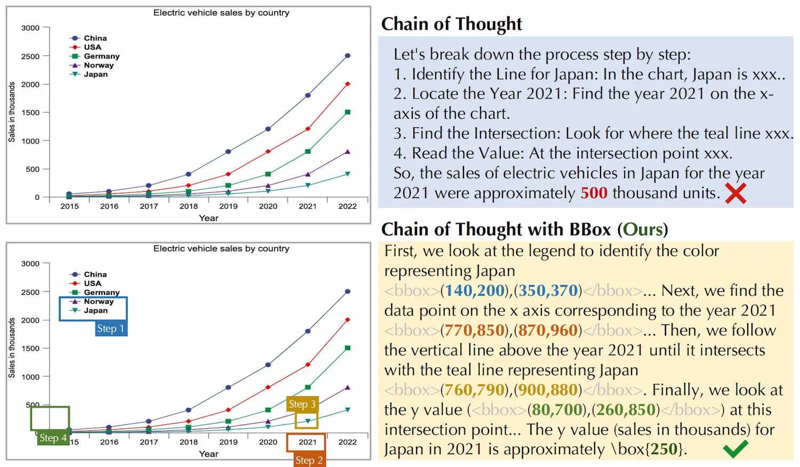
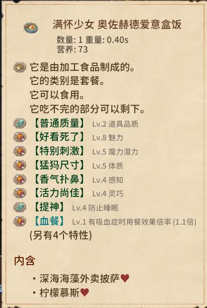

# ChartPoint: Guiding MLLMs with Grounding Reflection for Chart Reasoning[^1]

_用“接地反思”引导多模态大模型进行图表推理,解决数值幻觉问题_

### 背景：

MLLMs在图表理解中依赖OCR，但易受文本注释稀疏影响，导致数值幻觉。且现有方法侧重指令扩展，未能解决视觉感知的根本挑战。MLLMS对图表元素和比例关系的“接地”能力薄弱，无法将推理步骤与视觉区域对应。

### 解决方法与贡献：

- 提出PointCoT，利用BBox验证推理与图表内容的一致性。
- 构建ChartPoint-SFT_62k数据集（含19.2k高质量样本，含CoT、BBox、重渲染）。
- 开发ChartPoint2/2.5模型，在多个基准上超越SOTA。

> 来解释下这的文本注释稀疏是什么意思。一张柱状图中直接标注的文字通常只有柱子下的label，但图中真正重要的信息（每个柱子的高度、柱子之间的比例关系、趋势走向）没有任何文字标注，这就是“文本注释稀疏”——图上能OCR识别的文字太少了，大部分信息藏在视觉布局里，没有对应的文本描述。

### 所以现在的核心问题就是：如何在文本注释稀疏的情况下，实现准确的图表理解？

We prompt the model to point out the positions that match each reasoning step. Regrettably,MLLMs either overlook this request or generate entirely irrelevant positions.

那这里就很神秘了，在前一篇2026年的论文中，ZJU的团队证明了是可以做到这样的事情的：在CoT中加入了<focus>的步骤。为什么这个2025年的论文中就做不到呢？

原因大概是在Chart-FR1中，模型是经过一系列SFT的，不是靠prompt一个现成的通用MLLM就能直接学会的。所以ChartPoint的贡献是通过生成BBox和重渲染，主动建立这种对应关系。

为了达成这一点，他们引入了一个利用图表-代码对和高级LLM的自动标注管道，给予准确的步骤分解和关键信息定位。

#### 这个管道包含四步：

1. Step Decomposition

收集高质量的“图表-代码”数据对，并使用大语言模型（LLMs）来生成一个数值型问题及其对应的思维链（CoT）推理步骤。LLM会将每一步标注为“定位型”（需要从图表中提取数据）或“推理型”。对于所有“定位型”步骤，我们会在图表上添加特殊字符标记，示例中使用的是 @ 。

2. Code Editing

LLMs会通过在所有“定位型”步骤的关键位置插入特殊字符来修改代码，以便更轻松地提取位置信息。

直接使用MLLM来标注点是显而易见不可靠的，因此采用的是基于LLM的代码编辑方式来达成高成功率。这样每个grounding步骤都对应一份编辑过的代码。_为什么是代码，因为在训练阶段采用的都是代码生成的图片，旨在培养模型看图的能力。_

3. Code Rendering

执行所有修改后的代码，并且重渲染整张图表，如果任一CoT步骤失败或者触发警告，就会放弃这个采样。

4. Position Localization

对重渲染的图表使用OCR提取嵌入的字符位置，再经过规范性检查，最终获得BBox。

### 相关工作

模态对齐（把视觉特征和文本特征放到同一个空间里）是必须的。

两阶段方法的核心在于通过专门的提取模块来生成中间图表表示。

大致情况就是这样子，实际上是我也并不怎么懂，然后之后的事情接踵而至，这篇论文的解读也只好就此作罢。

**_end_**

> 最近开始玩Elin了，一不小心沉迷进去了，真是不赖啊，似乎重拾起高考完暑假时那般的决心了，之后闲暇时间可以往那边靠靠。
>
> 
>
> 晒晒少女给我做的便当，是关系到了\*\*LOVE\*\*之后还是什么阶段会送的？搞不清楚了，总之是今天点开对话突然看到的，除此之外还送了她自己的卡片和剥皮雕像，也是很恶趣味了。。。

[^1]: [ChartPoint: Guiding MLLMs with Grounding Reflection for Chart Reasoning](https://arxiv.org/html/2512.00305v1)
