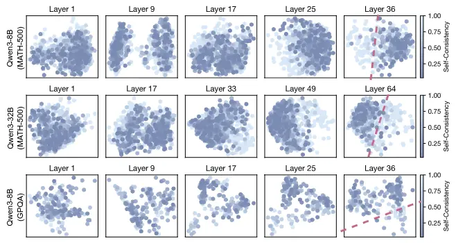

_自适应思考：大语言模型知道何时在潜在空间中进行思考。让大语言模型在推理时根据问题的难度，动态决定“思考”多长时间，从而在保持准确率的同时大幅节省计算资源_

# Adaptive Thinking: Large Language Models Know When To Think In Latent Space[^1]

LLM推理时的CoT能显著提升性能，但是固定预算效率不高，问题是如何为每个查询自适应地分配最优的思考预算？

自洽性意为让模型对同一个问题输入进行多次回答，回答的一致性高则说明自洽性高，答案一般大差不差；自洽性低的情况则意味着该查询比较复杂，需要更深入的思考。

**提出Sonata，一个轻量级适配器，通过预测查询的自洽性来动态分配思考预算。得到预测后，Sonata会在模型开始思考之前，就分配好比如允许本次生成多少思考token，简单题少想，难题多想。本质逻辑是读取模型隐藏层表示，“以过往经验，判断当下任务”。**

CoT很好，能显著提升模型面对复杂任务的表现。但出于对计算资源的担忧，对于简单问题的过度思考不仅浪费算力，有时还会因为想太复杂反而出错；对于需要深度推理的难题，给太少时间模型又可能抓瞎直接给出错误答案这样的问题，我们提出能不能在模型开始思考之前，就可以知道这饿问题到底有多难，需要多少思考时间？

因此提出**自洽性(Self-Consistency)**这个概念：给定一个查询，从LLM采样多条推理路径，最终答案的一致性程度。

> SC(q) = 1 / N * Sigma(i=1~N){I[ai = a*]}

在MATH-500任务中，随着难度增加，自洽性分数整体下降，有力校验了这一指标的可行性。

此外还验证了自洽性和思考收益的关系。过程不放出来了，总之就是自洽性分数与思考带来的性能提升之间存在强烈的负相关关系：低自洽性的查询启用思考后提升显著，反之亦然。说明了自洽性是判断是否需要以及需要多少思考的可靠指标，告诉我们一个问题是否值得投入宝贵的思考资源。

但是记得上面是怎么说的了吗？计算自洽性需要昂贵的重复采样，这与高效推理的目标相悖。如果为了决定要不要思考而又得先花大力气算一遍自洽性，那不就是本末倒置了吗？**所以关键问题来了，有没有可能直接绕过这个昂贵的采样步骤，直接从模型内部的状态中读取自洽性的信息呢？**

这就引出了论文团队的关键发现：一、他们发现不同自洽性水平的问题，在模型的潜空间里，也就是隐藏层表示里，是能被清晰地区分开来的。提取模型最后一层Transformer层输出的隐藏状态再用PCA降维到二维平面上画出来。结果如下图所示，无疑是非常惊人的！这说明模型内部似乎天然就编码了关于问题自洽性的某种信息。二、通过观察下图，我们也能发现这种区分能力随着网络层数的加深而增强，越靠后的Transformer层中高自洽性和低自洽性的点分得越开。不过想一想也是哈，越深层的网络通常复杂捕捉更抽象、更复杂的概念和推理模式，这其中很有可能就包含了自洽性的语义。

那么至此，问题的解就已经很清楚了，这告诉我们，不需要真的去跑多次推理来算自洽性，而是偷看下模型最后一层的隐藏状态就能大致得出这个问题自洽性的高低。

### Sonata框架概述

- 离线训练阶段: 使用校准数据集 Dcal，训练MLP适配器 fθ 将隐藏状态 hi 映射到 SCi。

- 在线推理阶段: 预测自洽性 s^，若 s^>τ0 则不思考，否则进行思考。

离线训练阶段对于每个校准问题，模型先跑一遍不思考模式，生成一堆答案，算出其自洽性分数。可以通过一个简单的MLP神经网络将最后一层Transformer最后一个token的隐藏状态和自洽性分数关联起来。

> 这篇论文是最近读过中最浅显易懂的，心情舒畅了很多，同时也给自己一个契机吧，这个双休日调整下，不要每天睡到下午了。虽然从一片黑暗中睁眼再挣扎起床是很痛苦的事情，由简入奢易啊，但坚持到卫生间冷水抹把脸应该会好很多。周末也出去走走看看吧，一直在教学楼和寝室间两点一线挺闷的。这样子写下来会不会好点，应该会比心理上无声承诺好点。
>
> 07-31今天是7月的最后一天，实习转眼间也是一个月之前做出的决定了，真应当感谢那个时候自己勇敢了一把，向师兄要到了在实验室实习的机会。一个月来也学到了很多，说不上毫无收获，也算是收获颇丰了。接下去一个月是师兄也着力到我们实验中来的时间，要加倍努力了！

[^1]:[Adaptive Thinking: Large Language Models Know When To Think In Latent Space](https://arxiv.org/html/2505.13417v1)