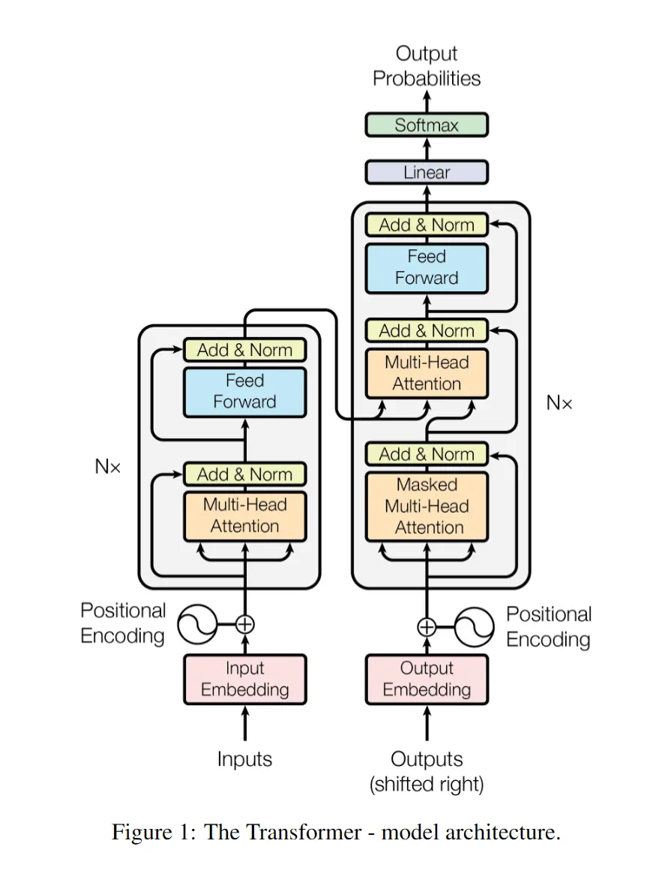
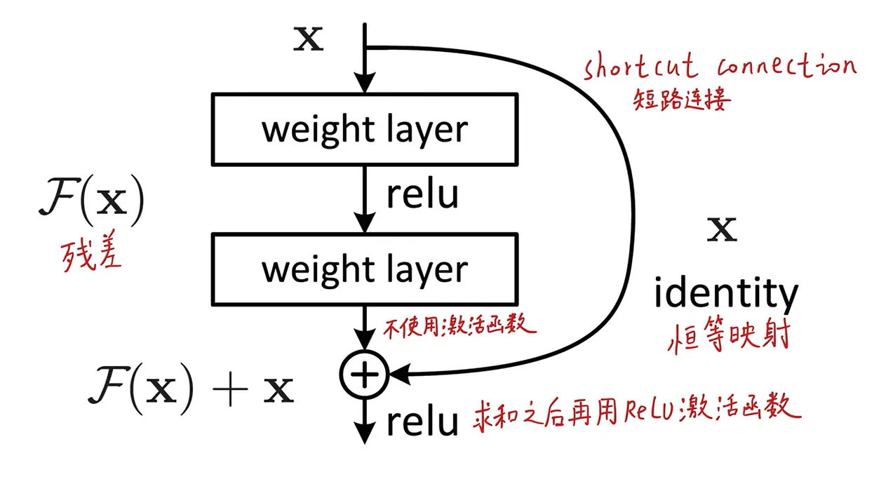

# VLM & EyeTracker Pt.1

_出于最近实习的原因，开始关注这方面的东西，越深入，越觉得要理解本质才能更好地制定方向，因此本文专注于梳理和解释 **VLM和Transformer** 前置知识，并且结合 **EyeTracker** 在其中起到的作用来展开。_

_第一次写长文，思路极乱无比，不好意思，但也正好能反应我逐渐（铸剑！要素察觉）成熟的思考过程不是吗_

## 一、VLM是什么

视觉语言模型，全称 **Vision-Language Model**，所有能同时处理视觉（图像/视频）和语言（文本）的模型，都可以叫 **VLM**。

> 有时也会看到 **LVLM**这种词汇，可以这样理解： **VLM** 是”大学生“（泛指所有模型），**LVLM** 是”博士生“（特指那些规模巨大、能力顶尖的模型）。
>
> - 早期的 **VLM** 只能做简单任务，比如判断一张图里是不是有猫；而 **LVLM** 能够结合常识进行推理，比如看一张梗图，解释笑点在哪里。
>
> 另外，如果如果你看到 **LMM**（大型多模态模型，Large Multimodal Model），那它和 **LVLM** 基本是同义词，只是”多模态“这个词涵盖的范围更广：还包括音频、视频等。

正在进行的工作应该会更偏向简单的方向一点，因为训练数据也全都是 ChartQA （对于图表的问答）。

### VLM 的工作原理

#### **VLM** 接受视觉和文本的数据，为了理解它们，每个词、每个图像区域进入模型之后，都会先变成一串数字向量。

细节一点的话，可以说：

- 输入的图像先被切成很多小块 `patch `，每个 `patch` 里面有很多像素值，把这些像素值摊平，再乘一个可学习矩阵，映射生成一组固定长度的图像特征向量，这组向量代表了图像的核心视觉信息。

- 输入的文本会被分词，即切成很多 `token`，然后每个 `token` 都会先变成一个 `id`，有点像字典编号，但 `id` 本身没有什么语义，它只是索引。接下来在词嵌入层 `embedding` 表中查询其对应的一串浮点数，然后通常还会加上位置信息，因为模型要知道词与词之间的顺序关系。

到这一步之后，图片和文字都变成了一串串向量，虽然来源不同，但对于模型来说，他们现在都是一串串高维数字向量。

#### 为了让文本和图像对应的向量能被统一起来理解，需要多模态特征融合。

因为如果不融合，他们就只是两堆各自独立的向量，模型不知道文本中的这个词应该对应图像中的哪个部分。融合的本质就是把文本语义和图像证据对应起来。

。
。
。

# _算了算了，还是从 <a href="https://arxiv.org/html/1706.03762" target="\_blank">"Attention Is All You Need" </a>[^1]这篇可视为当今大模型鼻祖的论文讲起。_

## Abstract

**主流的序列转换模型基于复杂的循环神经网络或卷积神经网络，这些模型通常包含一个编码器和一个解码器。**

_序列转换指的是把一个序列映射成另一个序列的任务，比如机器翻译就是典型例子。这篇论文发表在2017年，在此之前的主流做翻译、文本生成任务时，大家用的都是RNN或CNN架构，这些模型都是”串行“处理的——读一个词，更新一次状态，再读下一个词。_

**表现最好的模型还会用过注意力机制来连接编码器和解码器。**

_早期的注意力机制只是作为”辅助配件“存在的——RNN负责主流程，注意力机制帮它在编码器那边找找看哪个词时最相关的。实际上就是把当前的解码状态与每个编码器的隐藏状态的相似度做运算得到注意力权重，用这些权重对编码器隐藏状态做加权求和，得到一个上下文向量，将这个上下文向量拼接到解码器的输入中，一起预测下一个词。然后加入注意力机制让其隐藏状态与上下文中距离任意远的依赖关系，但都逃不出循环的架构。_

**我们提出一种新的、简洁的网络架构——Transformer——它完全基于注意力机制，彻底抛弃了循环和卷积结构。**

_这是全文最核心的话，整个网络里没有RNN、没有CNN，只有注意力层。这意味着计算可并行化，不需要等待着上一个词的隐藏态处理，训练速度大幅提升。_

**在两个机器翻译任务上的实验表明，这些模型在翻译质量上更优，同时更易于并行计算，并且训练时间显著减少。在WMT 2014英译德任务上，我们的模型达到28.4 BLEU，比现有最佳结果（包括集成模型）提升了超过2个BLEU。在WMT 2014英译法任务上，我们的模型用8块GPU训练了3.5天，达到了41.8 BLEU的新的单模型最优成绩，这仅是文献中最佳模型训练成本的一小部分。**

_展示了具体成绩，质量更优，训练时间还少。这里的BLEU是机器翻译的常用评价指标，分数越高翻译质量越好。集成模型指用多个模型投票/平均来提升效果，通常比单个模型强。但Transformer单个模型就超过别人的集成模型2个BLEU，这是很震撼的成绩。_

**我们展示了Transformer在其他任务上也有很好的泛化能力——在英语成分句法分析任务上，无论是在大规模还是有限训练数据下，都取得了成功。**

_这证明Transformer不只是翻译专用，而是一个通用的序列处理架构，这一点后来被充分证明——Transformer成为了NLP领域的”通用骨架“。NLP是Natural Language Processing（自然语言处理）的缩写，简单来说就是让电脑能看懂人话，并且能说人话。_

_这篇论文正是NLP发展史上的分水岭。在其之前，处理语言必须一个一个词按顺序读，而且慢，读到后面容易忘了开头，就算后面推出了遗忘机制等等，也还是个问题，不过那不是本文的重点。这篇论文则开启了大模型时代，它让机器能一眼看完整个句子，并行，通过注意力机制直接抓取词与词之间的联系。当前，则是预训练大模型时代，有很多经过Transformer训练的大模型如GPT、LLaMA具备了通用的语言常识，拿去微调下就能做其他领域的工作。_

## 1 Introduce

**循环神经网络（RNN），特别是长短期记忆网络（LSTM）和门控循环单元（GRU），已经被牢固地确立为序列建模和序列转换问题（如语言模型和机器翻译）的最先进方法（SOTA）。此后，大量的研究工作持续推动着循环语言模型和编码器-解码器架构的性能边界。**

_这个前面的东西不管那么多了，反正都是过时的东西，继续往下看，主要关注Transformer干了啥。_

**循环模型通常按照输入和输出序列的符号位置来分解计算。它们将位置与计算时间步对齐，生成一个隐藏状态序列 h*t，而 h_t 是前一个隐藏状态 h*{t-1} 和当前位置t的输入的函数。这种固有的序列化特性阻碍了训练样本内部的并行化，这在序列长度较长时变得尤为关键，因为内存限制会限制跨样本的批处理。近期的工作通过因子分解技巧和条件计算在计算效率上取得了显著提升，后者还同时提升了模型性能。然而，序列化计算的根本性约束依然存在。**

_这说了些RNN的根本性缺陷，比如必须串行、长序列内存爆炸、已有的改进不够。因子分解技巧：一种压缩计算的方式，比如把大矩阵拆成很多小矩阵相乘来减少计算量。条件计算：不是所有神经元都激活，只激活一部分，减少计算量。这些我也不懂，直接抄AI的。_

**注意力机制已经成为各种任务中强大的序列建模和序列转换模型中不可或缺的组成部分，它允许模型建模输入或输出序列中距离任意远的依赖关系。然而，除了少数情况之外，这种注意力机制都是与循环网络结合使用的。**

_这告诉读者，注意力机制已经被证明很有效（能抓取远距离依赖，不管两个词隔多远，都能直接建立联系）。但此时注意力只是辅助，主角还是RNN，这就是论文的切入点：既然注意力这么有用，能不能把它扶正，让它当唯一的主角？_

**在这项工作中，我们提出了Transformer，一种摒弃循环、完全依赖注意力机制来捕捉输入和输出之间全局依赖关系的模型架构。Transformer允许显著更高的并行化，并且在8块P100 GPU上训练仅12小时就能达到机器翻译质量的新SOTA。**

_所以抛弃循环、唯一构建模块就是注意力。SOTA的意思是State Of The Art，指最先进的、当前最佳水平。_

## 2 Background

**减少序列化计算也是Extended Neural GPU 、ByteNet 和 ConvS2S 这些工作的基础目标。它们都以卷积神经网络（CNN）作为基本构建模块，能够并行计算所有输入和输出位置的隐藏表示。在这些模型中，让任意两个输入或输出位置之间建立联系所需要的操作次数，会随着位置之间的距离增长——在ConvS2S中是线性增长，在ByteNet中是对数增长。这使得学习远距离位置之间的依赖关系变得更加困难。而在Transformer中，这被减少到了常数次操作，但代价是由于对注意力加权的位置做平均而导致有效分辨率下降，我们通过第3.2节中描述的多头注意力（Multi-Head Attention） 来抵消这个影响。**

_这里就是说CNN虽然不像RNN那样必须串行，但是距离越远的两个位置，建立联系需要的计算层数越多，就像两张离得很远的拼图，中间隔着好多层才能连上。而在Transformer里，任意两个位置建立联系只需要常数次操作，代价是”有效分辨率下降“。_

_那有人可能会问，CNN不是处理图像的吗，咋用到NLP里去了……或许还有很多其他问题，这段论文里省略了很多背景知识，没事接下来讲：_

_CNN一开始确实是为图像设计的，但CNN的本质是用一个滑动的小窗口，在数据上滑来滑去，提取局部特征。处理图像时，小窗口在像素网格上滑动提取边缘和纹理；处理文本时，小窗口在单词序列上滑动提取相邻几个词的局部模式。_

_那第二个问题：为什么CNN里距离远的两个问题，需要多层才能建立联系？比如说有一句话【”我“，”爱“，”吃“，”苹“，”果“】，那么在一个三格宽的窗口中，第一层卷积不能直接同时覆盖”我“和”果“，就必须用第二层在第一层卷积的基础上再卷积，这次就相当于都覆盖了，因为第一层的每个单元已经包含了3个位置的信息。那么一旦句子长起来，而窗口的大小有限，就需要更多层数去堆叠，计算量也大，中间信息也会丢失。_
_额额额。。。那卷积到底在卷什么呢？假如每个词已经通过Embedding层变成了一个512维的向量，那么整个句子输入给CNN的形状是5*512，一张5行512列的照片。卷积核就是一个3行512列的窗口，第一次滑动覆盖前3个词，盖住了3*512=1536个数字，然后卷积核用它自己里面的1536个参数与被盖住的1536个数字逐元素相乘，全部加起来，得到一个一维的数值，比如0.52，这个数字就代表了【“我”，“爱”，”吃“】这个局部组合的某个特征。接着窗口再滑动2次，再得到2个数字，0.18和0.89,那么5个词就被该卷积核抽象成3个数值，接着再卷第二层。最终得到一个数值表达了整句话的语义倾向，这才是模型看懂的全流程。_
_而任务的本质区分，就体现在输出层的维度上，在生成对话时，输出层的维度就是词典的厚度。假设字典中有五万个字，对于一个翻译的任务，模型计算到最后会生成五万个分数，再经过softmax归一化，把五万个分数变成五万个概率，挑选出概率最高的那个词。接下来就是解码器登场了，它的作用就是把上一步的输出当作下一步的输入，那么第二次输入的结果就是“开始符” + “我” + 编码器的3个向量”在它眼里中文和英文没有实质上的区别，因为训练的时候早就建立起他们之间的联系了，模型看到成千上万对这种“英-中”配对数据后，它会通过反向传播，硬生生地把“I”的向量和“我”的向量在数学空间里拉到一起。_
_那么读到这里你会觉得编码器和解码器在本质上是一样的，除去一些实现上的小区别外，实际就是共用一套代码实例化两次。那为什么要把他们分开叫“编码器”和“解码器”呢？因为在实际运行中，他们的使命完全不同：编码器负责一次性把整篇原文读完，提炼出语义摘要；解码器根据语义摘要和自己已经写出来的前半句，一个一个字往外蹦新词，加上“掩码”的设计，让其只看前文并写下一个词。你会发现，解码器被循环使用很多次，而编码器只用了一次。_
_OKOK，我觉得我总算把这个讲清楚了，那么继续。至于为什么在Transformer中是常数级操作，以及其为了解决”有效分辨率下降“而引入的多头注意力机制后面会讲到的。_

**自注意力（Self-attention），有时也称为内部注意力（intra-attention），是一种在单个序列内部将不同位置联系起来以计算该序列表示的注意力机制。自注意力已经在各种任务中成功应用，包括阅读理解、抽象式摘要、文本蕴含以及学习任务无关的句子表示等。**

**端到端记忆网络（End-to-end memory networks） 基于循环注意力机制而非序列对齐的循环结构，在简单语言的问答和语言建模任务上表现良好。**

_这边主要讲了从前采用的一些机制，感兴趣的自个去查吧，跟前面说的差不多，都是锦上添花的东西，但没解决实质性问题。我等不及快点进入正题了。_

**然而，据我们所知，Transformer是第一个完全依赖自注意力来计算输入和输出表示的序列转换模型，没有使用序列对齐的RNN或卷积。在接下来的章节中，我们将描述Transformer，阐述自注意力的动机，并讨论它相比于[17, 18]和[9]等模型（注：即前面提到的ByteNet、ConvS2S等）的优势。**

_序列对齐指模型的计算步数严格等于序列的长度，每一步都只处理当前位置的一个符号。回想一下刚才说的那些是不是都是这样子，而Transformer的并行计算，打破了这种“时间步=位置”的对齐约束。_

## 不过这里我想再等等，也是边解释边学习，在看了下方那期视频之后，我觉得先把开头和结尾说清楚，然后再讲核心概念，就能对每部分具体要干什么、为什么要这么干等问题有更清晰的认识。
> 3Blue1Brown的 <a href="https://www.bilibili.com/video/BV13z421U7cs/?share_source=copy_web&vd_source=b63f5927460d4d5518043823314b224c" target="_blank">【官方双语】GPT是什么？直观解释Transformer | 深度学习第5章】</a>[^2]

_所以语气会有点像3Blue1Brown的视频里那样，见谅。_

**Embedding Matrix 这个嵌入矩阵决定了第一步中每个单词对应的向量——词嵌入。就像其他矩阵一样，它的初始值随机，但将基于数据进行学习。我们可以将其视为高维空间中的坐标，重点是模型在训练阶段调整权重，以决定如何嵌入。这些坐标通常表示了某种语义关系，一个有趣的例子是：如果将”意大利“的嵌入值减去”德国“的嵌入值再加上”希特勒“的嵌入值，将结果与”墨索里尼“的嵌入值相比，哦天哪那是接近的。**

**为了更好地理解空间中的转换，我们可以暂且将其降维到三维空间中，降维这一步骤通常采用主成分分析（PCA），其核心思想是找到数据方差最大（散得最开）的若干个方向，将这些方向作为新的坐标轴，把原始高维向量投影到这些新轴上，从而在尽可能保留信息的前提下降低维度。可以想象这样一个场景，在一个三维坐标系中，我们发现所有的向量都恰好分布在空间中一个平面的附近，这时就可以取这个平面作为新的二维坐标系，投影那些向量到这个平面上，因为向量都分布在平面上下附近，所以并没有丢失多少信息，即相对距离和角度关系在大体上得以保留，从而保证了降维后的数据依然能反映原始数据的主要结构。**

**点积贯穿整个模型的计算过程，在空间上，两个向量的点积越”正“表明方向更具有一致性，在嵌入空间中，则表示了语义的相近性。向量并没有至此定型，在之后的模块中经历各种拉扯，会被指向更符合语境语义的方向，那些模块指的就是注意力模块。**

**因此构建能够预测下一个单词的模型时，目标就是使其能有效结合上下文信息。**

**回顾下，句子中的文本被分成tokens输入嵌入层中，每个向量都是直接从嵌入矩阵中拉出来的，这时或许每个向量代表的是单个单词的普适含义，也有可能毫无意义混乱至极不含上下文信息。而流经后方网络的主要目标就是使其在上下文中获得比单个词更具体的含义，可以想象这个庞大的向量矩阵必然是有体量上限的，其一次性能求解的向量的最大数量称为它的上下文长度。让我们具体地想象下这个矩阵的样子，比如在GPT-3中上下文长度是2048，也就是说最大允许2047个tokens作为单个token的上下文，该token也只能从其中学习语境语义；GPT用12288维的向量表示单个token的语义，所以这个矩阵将是极其庞大的12288行2048列的规模。**

**注意力模块的工作就是找出上下文中哪些词会改变哪些词的含义、以及这些词应该更新为何种含义。经历注意力模块后，这些含义都已经通过某种形式完全编码进了这些向量。然后这些向量经过多层感知机——也就是全连接层，人工智能通识课上最初学到的神经网络——来到多层感知机的最终层。**

**全连接层的最终层就是单词的语义，接着是解嵌入矩阵点乘语义向量。解嵌入矩阵也是一个单独的可学习矩阵，你可以简单理解为既然前面有个嵌入矩阵那么后面必然有个为将其脱出向量模式还原成token id的矩阵，它与嵌入矩阵在概念上是对称的——前者把token变成向量，后者把向量变回token概率——但两者是独立，各自在训练中更新，而不是简单的转置关系；更准确的理解是，解嵌入矩阵每行为一个单词的语义（嵌入矩阵中是每列），点积乘法将解嵌入矩阵的每行和最终层算出的下一个token的语义向量逐个元素相乘再相加。还记得空间中点积的含义吗，是求两者方向的接近性，因此在点积得到的向量中，如果发现某行的数值很大（经历softmax激活），就说明两者在语义上很相近，那么下一个词是这个id的可能性就很大，这就是Transformer架构图最上方得出的Output Probability的含义。**

**对于这边的嵌入矩阵我还有想说的， 既然嵌入得到的语义向量是随机的，且不管怎样还要经过一系列变换才能变成合适语义，那么嵌入矩阵有什么可学习的呢，通过反向传播嵌入矩阵有变的必要吗？有必要的，因为对于上下文的推理就正来源于最初始的语义，这个语义为了后续推理的loss小就必须调整成同族聚类的形式，比如说经过成千上万次的迭代，”猫“的向量就会慢慢地向”狗“、”兔子“等动物类别的向量靠近，同时远离”桌子“，”银行“等无关类别的向量。训练时是这样子，推理就不会了，用户输入之后，只要顺着正向传播走一遍就行了。**

**说到这里，又有个，如果模型只有前面的文本，那么后方的语义向量是怎么凭空变出来的呢？做法是训练和推理时都可以采用的，在要更新的位置新增一个占位符（全零向量或随机初始化向量），用来代表下一个生成的位置。模型用注意力，让这个占位符去”看“前面所有内容，然后预测出应该填什么词。**

_差不多了哈。写到这里的时候我也觉得荡气回肠，思路变得极其清晰了，接下去咱就是主要目的去攻克到底是什么神奇的机制能够加工原始嵌入向量到上下文语义了。_

## 3    Model Architecture

**大多数有竞争力的神经序列转换模型都采用编码器-解码器结构。在这里，编码器将输入序列的符号表示 (x1, ..., xn) 映射为连续表示序列 z = (z1, ..., zn)。**

_z = (z1, ..., zn)是编码器输出的“语义向量序列”,每个位置对应一个融合了上下文信息的新向量。“连续表示“指这些向量的值都是浮点数，不再是离散的符号ID。_

**在得到 z 之后，解码器逐元素生成输出符号序列 (y1, ..., ym)。**

_符号序列指离散的符号，即指解码器输出的译文。_

**在每一步，模型都是自回归的，即生成下一个词时，会把之前已经生成的词作为额外的输入。**

_这里包含了循环生成的含义， 意为第t步的输出，会成为第t+1的输入的一部分。_

**Transformer遵循这一整体架构，在编码器和解码器中都使用了堆叠的自注意力层和逐点全连接层，分别如图Figure 1的左右两半所示。**

_逐点全连接层FFN（Feed Forward Network）：实则就是两个线性变换层（FC）和一个非线性激活函数（ReLU），通过在两个升维降维的线性变换层中加入非线性变换可以增强模型的表达能力，捕捉到复杂的特征和模式，简单说就是能够拟合更加复杂的曲线。_

### 3.1 Encoder and Decoder Stacks

#### **Encoder：**

**编码器由 N=6 层完全相同的层堆叠而成。每一层有两个子层。**

**第一个子层是多头自注意力机制，第二个子层是一个简单的、逐点全连接的前馈网络。**

**我们在每个子层周围都使用了残差连接（Residual Connection），后面跟着层归一化（Layer Normalization）。**

**也就是说，每个子层的输出是 LayerNorm(x + Sublayer(x))，其中 Sublayer(x) 是子层本身实现的函数。**

**为了便于这些残差连接，模型中所有子层以及嵌入层，输出的维度都是 d_model = 512。**

> 

_上图就是个残差模块，其最先由ResNet（卷积深度达到了152层）提出，可以有效解决深层网络中的退化问题。残差连接就是在下层的输入中保留了完全相等的上层输入。这个模块的含义就是现在不需要去拟合真正的底层的分布了，现在只需要在原来的输入恒等映射的基础上修改残差就可以了。
怎么说呢，就是假设原本要拟合的曲线是H(x)，当前几层已经使输出x等于H(x)时，此时模型最好的办法就是原封不动地把x继续传递下去，我现在将维护的对象变为F(x)=H(x)-x，也就是说任务变成了维护F(x)为0，那么最简单的做法就是什么都不做，保持权重都是0就可以，简单、自然、收敛快。
那为什么普通的网络做不到什么都不做呢？因为在普通的前馈网络中（没有残差连接）里，每一层都要做一个标准的数学变换：**输出 = 激活函数( 输入 × 权重矩阵 + 偏置 )**。想让这一层“什么都不做”，即 输出 = 输入，意味着个这一层的权重矩阵必须被训练成“单位矩阵（对角线为1，其余为0）”，偏置必须被训练成“全0”，这在数学上一个极其严苛的条件。_
_意思很像“给孩子报了辅导班至少不会比原来更差“，我想这个是很形象的。_
_还有一种解释是，比如在Relu激活函数中：小于0置0，大于0不变，会造成不可避免的信息损失，而原封不动地传递上一个输出弥补了高度非线性造成的不可逆的信息损失。_
_反向传播也是一样，H(x)对x求梯度，你会观察到始终有1的存在，这样就不会梯度传着传着为0了，即梯度消失。_
_那在ResNet中实际是很多残差模块堆叠起来的，这样就可以使网络非常的深。欸欸额。。。那有了这个之后可不可以无限制地堆叠深度呢，在那篇Deep Residual Learning for Image Recognition中堆叠了一个1202层的网络，发现在某些数据集上效果反而更差，原因总结为可能是在较小的数据集上过拟合了。_

#### **Decoder：**

**解码器也由 N=6 层相同的层堆叠而成。**

**除了编码器里有的那两个子层（自注意力 + FFN）之外，解码器插入了第三个子层，这个子层对编码器堆栈的输出做多头注意力（即交叉注意力）。**

_再看下那张架构图，你可以观察到编码器将N层的输出传递给了解码器中的自注意力和FFN中间那层，这即是”交叉注意力“。比如在一个翻译任务中，此时解码器就能根据英文原文信息和已生成的中文再做进一步分析。_

_再者，我们可以对比左右两边的结构，会发现编码器有的部分（残差块包裹的多头自注意力和FFN）——解码器也有对不对，解码器多的就是从编码器融合来的信息，如果没有这块，那么两者间就没有区别，整个模型变得只有一个解码器也能工作。所以交叉注意力层的作用，就是让解码器在生成当前词的同时，能够查阅原文中相关的部分。同时也提升了可解释性，如果把注意力权重画出来，就能直观地看到模型在翻译时正在看原文的哪个词。_

**和编码器一样，我们在每个子层周围都用残差连接 + 层归一化。**

**我们还修改了解码器中的自注意力子层，防止当前位置关注到后续位置。**

**这种掩码，再加上输出嵌入整体偏移一个位置的事实，确保了第 i 个位置的预测只能依赖小于 i 的已知输出。**

_这里的掩码机制就很有意思了，可以看到，在训练时Outputs输入的就是中文答案，解码器虽然能一次性拿到完整的答案序列（训练阶段的人为设定），但是要模拟测试时的自回归场景，避免其利用未来信息进行作弊性预测，就让每个token的向量在进行调整时就只能看自己本身和自己前面的语境，从而保证训练与推理的输入分布一致。_

> _这里还有点非常抱歉，是写到后面才意识到的：为当前单词添加注意力时并不是用一个占位符去覆盖她，而是将输出整体向右偏移一个位置，在开头加上<start>来表示开头。
> 比如这样_
>
> _输入： [ <start>, I, love, you ]_
> _输出：[ I, love, you, <end> ]_
>
> _当要预测“I”位置时，指针就停留在这里，掩码覆盖了"I"和“love”和“you”。模型能读到的也只有“<start>”，它现在要预测输出“I”，和测试数据中的“I”相等，那么ok不用调整，不对的话就继续调整各种权重。话是这么说，但是实际推理的时候要维护的是与目标曲线的残差，向上输出的是x+残差，也就是说，这层推理出的就是语义空间中的位移，从“<start>”指向“I”，前面讲到的残差模块就在这里发挥作用。毕竟直接从“<start>”推出“I”是很难的。_

_那可能有人要问了：既然都这样了，何不干脆像推理时那样，一步一步喂进去？不行的，训练数据数以亿计，串行地输入目标序列，不仅速度很慢，而且体现不出Transformer并行计算的优势。_

_那具体是怎么实现的呢？很巧妙！在计算注意力时，把未来位置强行设成负无穷，这样经过softmax函数（它将任意实数向量映射为概率分布）之后，这些位置的权重就变成0，相当于模型完全看不到它们。_

_关于softmax函数，还有一点细节，_$\text{Softmax}(\mathbf{Z})_{ij} = \frac{e^{Z_{ij}}}{\sum_{k=1}^{K} e^{Z_{ik}}}$，_如果在每个Z下除以t（温度），就可以控制概率的分布：高温下会给低值赋予更多权重，使得分布更均匀；低温下较大的数值会更占优势。模型生成文本用采样的方式，也就是说温度控制了选到高值的概率。_

_**接下来讲核心公式，集中注意力！**_

### 3.2	Attention

**注意力函数可以描述为：将一个查询（Query） 和一组键-值对（Key-Value pairs） 映射到一个输出（Output），其中查询、键、值和输出都是向量。**

**输出被计算为所有 Value 的加权和，其中分配给每个 Value 的权重，是由 Query 与对应的 Key 的兼容性函数（compatibility function） 计算得到的。**

_你可能想问为什么是一个查询对应了一组键-值对，这样数量上的不对等是正常的吗？其实正好是符合了我们利用上下文的思路的。我们要做的仅仅是对当前序列末尾的词向量加工，通过对前文若干词向量中信息的吸收，来给末尾词向量添加一个位移指向预测的词向量。_

_接下来看具体是怎么进行吸收的。_  

#### 3.2.1	Scaled Dot-Product Attention

**我们把这种特定的注意力机制称为“缩放点积注意力”（Scaled Dot-Product Attention），如图Figure2所示。输由维度为 `dk` 的 Query 和 Key，以及维度为 `dv` 的 Value组成。**

**我们计算 Query 与所有 Key 的点积，然后除以 √dk，再应用 Softmax 函数，得到每个 Value 的权重。**

**在实际操作中，我们同时计算一组 Query，把它们打包成矩阵 Q。Keys 和 Values 也分别打包成矩阵 K 和 V。我们计算输出矩阵为：**

[^3]

_我们需要知道训练好的注意力模块，能计算出给初始的泛型嵌入加个什么位移，才能把它移动到上下文对应的具体方向上。_

_直接去解释这个Q、K、V到底为何物确实很困难，我们不妨从一无所有的角度去思考这个问题，然后一步一步推导到现有的模式。现在清空你的脑袋，想象这样一副场景，你处在三维坐标系的原点，数轴往外是一开始的宇宙，如同大爆炸过后，一切事物并无规律，所有token指向的语义都混沌极了。我们怎么样才能让当前的占位符（为方便理解设为0向量，也就是原点）充分理解到上下文的语境，使其自身在语义空间中往对的方向去位移呢？请注意，此时的计算是并行的，也就是说在自然语义上相似的东西都在向彼此靠近。_

_第一步是很自然的，既然我们想要让它去融合上下文中所有的信息，就把它与其他所有的嵌入向量点积，就能得出它与其他所有向量的相关性，根据相关性加权求和上下文词向量，直接加到自身。这个操作在每个词向量身上都发生，且同时发生，可以想象这是群体的趋同，最终会怎么样：**坍缩成一个点！**因为每个词都在吸收除自己以外其他的信息，而且没有约束机制来阻止它们变得相似。经过几个批次迭代后，所有向量的方向会越来越接近，最终变成几乎相同的方向——所有信息被平均化，失去了区分度。这显然不是我们想看到的。呃呃。。。底层确实是这样的，但是要注意，每个注意力层后还有个FFN层，其中的ReLU激活函数会强行“拉开一些向量”，让它们在语义空间中分化，形成各自独特的表示。但这样还远远不够，纵使词向量的语义空间维度很高，若放纵这样下去，有限层后每个分支仍然会趋向同一。_

_所以接下去应当怎么优化呢？我们需要停下来想一想，“坍缩”的根本原因是什么——是因为每个词向量同时扮演了两个角色：**它要去问别人谁跟我有关？同时要被别人问我包含什么信息？**，如果这两个角色共用一套向量，问题就出在这：好比在一个会议室里，所有人同时用自己当前的想法去问别人、同时回答别人，最后大家的想法必然会趋于一致，因为每个人在吸收别人的同时也在贡献自己，没有一个机制来区分“我想从你那里得到什么”和“我能提供什么”。_

_于是我们终于得到一个正确答案：让每个词向量学出三个不同的投影，把它映射到三个不同的子空间：_

- Query空间：我想从别人那里获取什么信息 
- Key空间：我有什么特征可以被别人匹配 
- Value空间：我真正要贡献的内容是什么

_所以在朴素意义上对注意力的理解可能会偏向计算两个词嵌入的直接相似度，但实际上是计算两个词分别在QK空间上的投影的相似度，否则两个相同的词永远最相似，这显然不是我们想看到的，我们希望的是一个词能够提取其自己想要的特征。譬如一个名词向前文中每一个token发出寻找形容词的Q向量，会发现形容词的K向量与其吻合良好，于是形容词使用V向量向名词传递自己的内涵。_

_怎么得到这三个投影呢？答案是用三个不同的可学习矩阵W\_Q、W\_K、W\_V分别乘以原始向量x，在上面的例子中就相当于把将嵌入空间中的词向量映射到较小的对应空间中的某个方向，用向量来编码寻找前置形容词的概念。注意力机制试图量化了逻辑，但是这一逻辑本身就相当地难理解（至少在我看来），而且这逻辑初始时还不存在，只能通过模型一步步地反向传播自己悟到需要这样子去调整参数使得loss最低，极具黑箱性，我觉得大致理解就差不多了吧，V可能真的包含点语义信息，但是Q和K转置的乘积同时出现，同时被调整，呈现出的逻辑也只是大体上得来，内部将其分开可能不会这样子清晰。至于解释也是人为规定的，整个设计无疑是天才的创作，欸欸像我这样的普通人只好先去接受这个现实，然后从可解释的方面去理解它。_

_**不过！**就在刚刚啊就在刚刚07-21-01:48，我注意到Q、K矩阵的维度，于是突然想到一种巧妙的理解方式。GPT-3中：Q和K做的是降维，即把12288维的嵌入向量降维到128维空间中进行点积运算，降维的目的和PCA很像——去除冗余信息，只保留最核心的特征。在12288维的词向量里，包含了很多信息：词性、语义、语法角色、情感色彩……但是对于“我现在要找谁跟我相关”这个问题，不需要那么多信息，只需要提取出最关键的特征就行。所以W\_Q和W\_K可以自己学会压缩高维空间中冗余的维度，压缩到低维更加有效。还有的话，就是直接在12288维空间中做点积几乎会变成one-hot，无论怎么来说都是不行的，降维本身就是一种防止梯度消失的手段。_

**两种最常用的注意力函数是加性注意力（additive attention）和点积注意力（dot-product / multiplicative attention）。**

**点积注意力与我们的算法完全相同，只是少了一个 1/√dk 的缩放因子。**

**加性注意力使用带一个隐藏层的前馈网络来计算兼容性函数（即 Query 和 Key 的匹配程度）。**

**虽然两者在理论复杂度上相近，但点积注意力在实际中要快得多、省内存得多，因为它可以用高度优化的矩阵乘法代码来实现。**

_这个加性注意力机制提出的较点积注意力机制早啊，主要公式是score(q, k) = vᵀ · tanh(W₁q + W₂k)，我们可以理解成将Q向量和K向量映射到同一特征空间后进行求和，再通过非线性变化生成注意力分数，这样对应的Q和K方向相同结果就大，不对应就正加负显得小了，也能达成相同的效果。被淘汰的原因正如上文所说，它可以被优化后的点积注意力代替。_

**当 dk 较小时，两者表现相近；但当 dk 较大时，不加缩放的点积注意力表现不如加性注意力。**

**我们推测，当 dk 较大时，点积的数值会变得很大，把 Softmax 函数推入梯度极小的区域。**

**为了抵消这个影响，我们用 1/√dk 来缩放点积。**

_点积注意力并非百利而无一害。相对于相加的逻辑，相乘在大dk下显得更陡峭。大的点积值经过softmax后，输出会极端接近one-hot（最大值接近1，其余接近0），这就导致了输入即使变化很大，输出仍然是0.99999，纹丝不动。这是梯度接近于0，反向传播时，传到底层的更新量几乎等于0，就没法迭代参数，这就是梯度消失。_

_为了缓解这个问题，可以将点积结果除以√dk，因为是相乘的关系，所以标准差相当于放大了自身倍，除回来还原一开始的规模。_

_以上这些就是**单头**注意力机制，这个过程由三种填满了可调参数的矩阵实现。_

#### 3.2.2  Multi-Head Attention

**我们没有只用一个注意力函数来处理 d_model 维的 keys、values 和 queries，而是发现把 queries、keys、values 分别用 h 组不同的可学习线性投影，投影到 dk、dk、dv 维，这样做更有好处。**

**在每一组投影后的 queries、keys、values 上，我们并行地执行注意力函数，得到 dv 维的输出值。**

**这些输出被拼接在一起，然后再做一次投影，得到最终的输出值，如下图所示。**

>

_从维度角度去理解实际上这样的：GPT-3中有96个注意力头，输入序列经过Embedding是n*12288维的矩阵，每行一个token；对于第i个头，都拥有可以将嵌入向量投影到128维的Q、K、V矩阵；接着每个头独自计算注意力，此时每个头的输出仍然在128的低维空间；为了还原到12288维的高维语义向量，将96个头的输出直接沿着列方向**拼接**（Concat），恢复成12288维；最后，进行一次投影，乘12288维的方阵W\_O矩阵，融合所有头的信息，让模型可以跨头地组合模型。_

_可能会觉得直接按列拼接多头的注意力输出很粗暴，但是实际上连着后面的W\_O就是在做加权输出，由模型自己学习怎么跨头组合信息，这都是可以被训练出来的。如果是升到12288维再相加平均，经过前面那么多的理论学习，你也一定能够知道是不行的，模型没法灵活选择“哪个头的信息更重要了对不对”。_

**多头注意力让模型能够同时关注来自不同表示子空间、不同位置的信息。**

**如果只有一个注意力头，这种能力会被“平均化”所抑制。**

_如果只用一个头，那么所有信息都被压缩到一次注意力计算里，结果往往是“中庸的”——各种信息混在一起，反而哪个方面都抓不准_

$$\begin{gathered}
\text{MultiHead}(Q, K, V) = \text{Concat}(\text{head}_1, ..., \text{head}_h)W^O \\
\text{where } \text{head}_i = \text{Attention}(QW_i^Q, KW_i^K, VW_i^V)
\end{gathered}$$

**其中，这些投影对应的参数矩阵分别是：**

- $W_i^Q$：$d_{\text{model}} \times d_k$
- $W_i^K$：$d_{\text{model}} \times d_k$
- $W_i^V$：$d_{\text{model}} \times d_v$
- $W^O$：$h d_v \times d_{\text{model}}$

_这里用Q、K、V完全是不易于理解的，不知道还以为是单头注意力里的投影矩阵呢，其实这三个是一个意思，都是X，嵌入向量矩阵。_

**在本工作中，我们使用h=8个并行的注意力层，或称为“头”。**

**对于每一个头，我们设置：**

$$d_k = d_v = \frac{d_{\text{model}}}{h} = 64$$

**由于每个头的维度降低了，总计算量和单头全维度注意力的计算量相近。**

_多头注意力在几乎不增加计算成本的前提下，获得了更多的视角。_

#### 3.2.3  Applications of Attention in our Model

**Transformer 在三个不同的地方使用了多头注意力：**

- **在 “编码器-解码器注意力” 层中，Query 来自解码器的上一层，而 Key 和 Value 来自编码器的输出（即“记忆”）。这使得解码器的每个位置都能关注到输入序列中的所有位置。这模仿了序列到序列模型中典型的编码器-解码器注意力机制。**

_这就是我们之前讲的交叉注意力，Key和Value来自编码器的输出，Query则来自解码器中正在预测的那个词。_

- **编码器包含自注意力层。在自注意力层中，Key、Value 和 Query 都来自同一个地方——在这里，就是编码器上一层的输出。编码器中的每个位置都能关注到编码器上一层中的所有位置。**

- **类似地，解码器中的自注意力层允许解码器中的每个位置关注到解码器中包括当前位置在内的所有先前位置。我们需要阻止解码器中的信息向左流动（即让当前位置看不到未来的词），以保持自回归（auto-regressive） 特性。我们通过在缩放点积注意力内部，把对应非法连接的所有值屏蔽掉（设置为 −∞） 来实现这一点。**
  

_注意是要在softmax层之前进行设负无穷，否则无法保证输出的列总和是1。_

### 3.3 Position-wise Feed-Forward Networks

**除了注意力子层之外，编码器和解码器的每一层都包含一个全连接前馈网络（feed-forward network），这个网络分别且相同地应用于每个位置。**

**它由两个线性变换组成，中间夹着一个 ReLU 激活函数。**

**FFN(x) = max(0, xW₁ + b₁)W₂ + b₂**

**虽然线性变换在不同位置上是相同的（共享参数），但不同层之间使用不同的参数。**

_同一层内所有词共享同一组W₁、W₂、b₁、b₂。不同层之间各学各的。这都没毛病，以上的各种东西前文中也有讲过，如果您对这块记忆比较模糊，可以借助Ctrl+F键于前文搜索。_

**另一种描述方式是：这相当于两个内核大小为 1 的卷积操作。**

**输入和输出的维度是 d_model = 512，内层的维度是 d_ff = 2048。**

_内核为1意味着卷积窗口只覆盖一个token，不跨token融合，这正好对应FFN的“逐位置”性质，大白话就是全连接啦。_

### 3.4 Embeddings and Softmax

**与其他序列转换模型类似，我们使用可学习的嵌入（learned embeddings） 将输入token和输出token转换为 d_model 维的向量。**

**我们还使用常规的可学习线性变换和softmax函数，将解码器的输出转换为预测下一个token的概率分布。**

**在我们的模型中，两个嵌入层（输入嵌入和输出嵌入）和softmax之前的线性变换共享同一个权重矩阵。**

_这篇论文里采用的是嵌入层和解嵌入层用一个权重矩阵，就是转置的关系；现代的大模型中另一种趋势越来越流行，即不共享权重，两个矩阵分开训练。_

### 3.5 Positional Encoding

**因为我们的模型没有循环也没有卷积，为了让模型能够利用序列的顺序信息，我们必须注入一些关于token在序列中相对或绝对位置的信息。**

_Transformer的核心是注意力机制，它是置换不变的——也就是说，如果把 "我 爱 你" 换成 "你 爱 我"，注意力算出来的结果是一样的。思考一下是不是这样子？在对前文value进行整合的时候只是直接相加来算位移，并没有加入位置信息。_

**为此，我们在编码器和解码器堆栈的底部，将“位置编码”加到输入嵌入上。位置编码的维度和嵌入一样，都是 d_model，所以两者可以相加。**

_直接相加确实是可以表示意义的，起码在不同位置的编码加上去后会导致点积差异变大，这就足够了，其余的事情让模型自己去学就完事了。这样可能是会抵消掉某些信息，但是加法带来的信息损失远小于不编码位置带来的损失，而且位置编码本身也是可以学习的，后人在这个基础上有做出很多改进。_

**位置编码有很多选择，可学习的和固定的都有。**

**在本工作中，我们使用不同频率的正弦和余弦函数：**

$$\begin{aligned}
PE_{(pos, 2i)} &= \sin(pos / 10000^{2i / d_{\text{model}}}) \\
PE_{(pos, 2i+1)} &= \cos(pos / 10000^{2i / d_{\text{model}}})
\end{aligned}$$

**其中 pos 是位置，i 是维度。也就是说，位置编码的每个维度对应一个正弦波。这些正弦波的波长形成从 2π 到 10000 × 2π 的几何级数。**

_可以观察到维度越低，波长就很短，变化快：适合编码局部相对位置；高纬度则波长长，变化慢，适合编码全局绝对位置。_

**我们选择这个函数，是因为我们假设它能让模型更容易地根据相对位置来学习注意力，因为对于任意固定的偏移量 k，PE(pos+k) 都可以表示为 PE(pos) 的线性函数。**

_这是很有好处的，我把数学性质列出来你就懂了：_

_sin(a + b) = sin(a)cos(b) + cos(a)sin(b)_

_cos(a + b) = cos(a)cos(b) - sin(a)sin(b)_

_这样子意味着对于模型而言，当要关注当前位置往前第3个词时，它只需要学会一个固定的线性变换(对应k=3)就可以了，这个变换在序列的任何位置都成立，所以模型很容易泛化。_

**我们也尝试了使用可学习的位置嵌入，发现两种方法的结果几乎相同。我们最终选择正弦/余弦版本，是因为它可能让模型在遇到比训练时更长的序列时，仍然能进行外推。**

_固定的位置编码提供了一种可拓展的范式，使得面对更长的序列，只要继续外推即可。_

## 4   Why Self-Attention

。

。

。

_接下去是论文的 第4章至第7章（训练、结果、结论）。这部分相对不那么“数学密集”，主要是工程实现细节和实验结果。偏向于老生常谈的话了，总之链接也给出来了，感兴趣的各位自己去读读吧。_

_绝不是这篇文章我已经写了n天了筋疲力竭还没有讲到EyeTracker的原因，总之先到这结束吧_

_分个P，前方的道路之后再来探索吧_

**_to be continued..._**

原因是突发奇想换到一台老旧的Thinkpad X1 Carbon（没错就是那个14年的放现在看来的老古董）上敲这篇文章，这个润滑细腻的键帽太舒服了。之前写markdown都是用的Typora，那个渲染得真不赖说实话。Typora是使用的序列号来激活，偏偏当时拿来收取序列号的邮箱因为各种原因注销掉了，人还在外面没有一点办法。出于机缘巧合下“那就试试看Vscode上的Markdown插件吧”的想法，结果是鹅鹅鹅效果还可以的，美中不足的可能是跟pandoc的默认css不太一样，反正网站后期肯定是得搞黑夜模式的，那就按着这个来参考也不错——黑夜模式下的红色链接变成蓝色，蛮酷的。

给各位看下现在的桌面环境是什么样子的，什么你说那超级无敌笨重烧柴油潮汐声风扇笔记本怎么办，放着舒缓音乐当背景板罢:D

关于这台华硕天选6Pro真是有很多可以吐槽的点，早知道使用场景的话，当时肯定选择更实惠的air了。现在可能也只有放宿舍里当作ssh服务器会算是起到了一点用处，一个字给到拉完了:(

[^1]: [Attention Is All You Need](https://arxiv.org/html/1706.03762)
[^2]:[【官方双语】GPT是什么？直观解释Transformer | 深度学习第5章](https://www.bilibili.com/video/BV13z421U7cs/?share_source=copy_web&vd_source=b63f5927460d4d5518043823314b224c)
[^3]:[Self-Attention机制的计算详解_自注意力机制公式-CSDN博客](https://blog.csdn.net/qq_41915623/article/details/125161008)